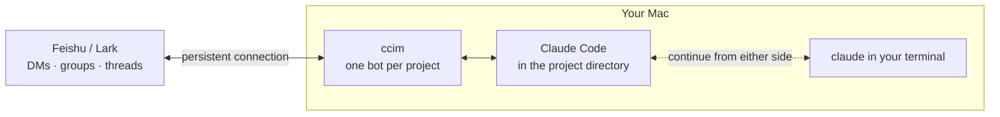

<div align="center">

# ccim

**Chat with the Claude Code on your Mac — from Feishu / Lark**

One bot per project. Send a message from your phone, and Claude gets to work in that project's directory.

[](LICENSE)    

[简体中文](README.md) · English

</div>

---

## Features

- 📱 **Claude Code wherever you are**: a message in Feishu is like typing into Claude Code in your project directory. Your CLAUDE.md, skills and slash commands all work, using the `claude` login already on your Mac.
- ⚡ **Set up with one scan**: on first run, scan a QR code and a bot is created under your Feishu account. No developer-console setup, no public URL.
- 👀 **See what it's doing**: a live "Working" card shows what Claude is reading, editing and running.
- ✋ **You approve what matters**: operations that need your sign-off show up as an approval card — one tap to decide.
- 🧵 **Threads stay out of the way**: start a thread on any message and the replies stay in that thread. Each thread branches off the main conversation.
- 📎 **Files both ways**: send it images and files; ask it to send back screenshots, videos or results.
- 🔁 **Switch between computer and phone**: heading out mid-conversation in Claude Desktop or the terminal? One sentence moves it to Feishu; pick it back up in the terminal when you return.
- 🛡️ **Answers only to you**: it responds to you alone, and you decide whether others in a group can use it. Secrets live in the macOS Keychain.
- ♻️ **Always on**: starts at login and recovers from crashes and network loss. Messages are retried on flaky networks, so replies don't get lost.

## How it works



ccim runs on your own Mac. Feishu messages arrive over a persistent connection, and ccim hands them to Claude Code in the project directory. Every DM, group and thread gets its own conversation.

## Quick start

**You need:** macOS · Python 3.11+ and [uv](https://docs.astral.sh/uv/) · [Claude Code](https://docs.anthropic.com/en/docs/claude-code), installed and logged in · a Feishu or Lark account

**1. Install**

```bash
uv tool install --compile-bytecode git+https://github.com/lzy2025ai/ccim
```

**2. Run it in your project and scan to pair**

```bash
cd your-project
ccim
```

A QR code appears in the terminal. Scan it with the Feishu / Lark mobile app and confirm — the bot is created. Search for the bot's name in Feishu and send it a direct message to start.

**3. Keep it running (optional)**

```bash
ccim start --always
```

Starts at login and recovers from crashes and network loss. Closing the terminal doesn't affect it.

> Upgrade: `uv tool upgrade ccim`

## In Feishu

| You | What happens |
|---|---|
| Send a direct message | An "OnIt" reaction appears on your message to show it was received. Your DM is one long-running conversation that survives restarts |
| Ask it to do something | A "Working" card shows the latest steps live; it turns green when done, and the answer arrives as a separate message |
| Hit an operation that needs approval | An approval card appears: Allow / Allow for this session / Deny — or just reply `y` or `n`. Unanswered after 10 minutes counts as Deny |
| Send an image or file | Saved to the project's `.ccim/inbox/`, where Claude can read it |
| "Send me the cover image" | It sends images, videos or files into the chat (images up to 10 MB, files up to 30 MB) |
| Reply in a thread on a message | Replies stay in the thread. The thread remembers what came before; nothing said in it flows back to the main conversation |
| Add it to a group and @mention it | The group is a fresh conversation. By default only your @mentions get a response |

### Slash commands

| Command | What it does |
|---|---|
| `/new` | Start a new conversation |
| `/resume [id]` | Without an id: list this project's recent conversations, including ones started in the terminal. With an id: continue that conversation |
| `/stop` | Stop the current task and clear the queue |
| `/status` | Current status, model and effort level |
| `/model name` | Switch model: `opus` `sonnet` `haiku` `fable`, or a full model name |
| `/effort level` | Effort level: `low` `medium` `high` `xhigh` `max` |
| `/help` | Help |

Any other slash command is passed to Claude as-is, so your project's skills and `/compact` work too. Commands sent in a thread only affect that thread.

## Command line

| Command | What it does |
|---|---|
| `ccim` | Run in the foreground for the current directory (Ctrl+C to quit); pairs first if needed |
| `ccim start [project]` | Run in the background; closing the terminal doesn't affect it |
| `ccim start --always [project]` | Keep it running: starts at login, restarts about 30 seconds after an unexpected exit |
| `ccim stop [project]` | Stop it (and turn off `--always`) |
| `ccim restart [project]` | Restart |
| `ccim list` | All paired projects and whether they're online |
| `ccim show [project]` | Details for one project: bot, status, model, effort level, conversations |
| `ccim handoff` | Run inside a Claude Code conversation: move that conversation to your Feishu DM |
| `ccim resume [project] [id]` | Continue a Feishu conversation in your terminal; defaults to the most recent one |
| `ccim logs [project] [-f]` | Show background logs |
| `ccim config [project] key=value` | Project settings, see below |
| `ccim unpair [project]` | Unpair |

`[project]` can be the project's directory name, the bot's name, or a path. Leave it out to use the current directory.

## Settings

```bash
ccim config group=all          # respond to everyone's @mentions in groups (default owner: only you)
ccim config model=sonnet       # default model for this project
ccim config effort=high        # default effort level for this project
ccim config reaction=THUMBSUP  # reaction added to incoming messages (default OnIt)
ccim config                    # show current settings
```

If you don't set a model or effort level, ccim follows Claude Code's own settings (the project's `.claude/settings*.json`, then `~/.claude/settings.json`) — the same ones your terminal uses. `/model` and `/effort` in a chat only apply to that chat. Run `ccim restart` after changing settings.

## Security

- **Owner only**: it responds only to the person who scanned the QR code when pairing. Direct messages from anyone else are ignored, and groups default to you only.
- **Approvals are yours**: only your taps on approval cards count.
- **No secrets on disk**: the App Secret is stored in the macOS Keychain (service name `ccim`), never in a file.
- **Not wide open**: Claude Code runs in auto permission mode, which blocks obviously dangerous operations.

> [!WARNING]
> Think before turning on `group=all`: people in the group can have Claude read and write files and run commands in this project on your Mac. Auto mode blocks obviously dangerous operations, but it isn't foolproof. In groups, Claude can only send files from inside the project directory.

## FAQ

<details>
<summary><b>The QR scan didn't work. What now?</b></summary>

You can enter an App ID and App Secret manually instead. In the Feishu / Lark developer console, create a custom app, enable the bot capability, choose "persistent connection" for both events and callbacks, and subscribe to the "receive message" and "bot added to group" events and the "card action" callback.

After manual pairing, the terminal shows a claim code. Send that code to the bot in a direct message and it will recognise you as its owner.
</details>

<details>
<summary><b>Will many projects or frequent new conversations eat up resources?</b></summary>

No. Each paired project uses about 110 MB while running. Each active conversation uses about 200 MB, plus any MCP servers you've configured for Claude Code; it's released after 30 minutes of inactivity and picked up again on the next message. `/new` closes the old conversation before starting a new one, so nothing piles up.
</details>

<details>
<summary><b>I'm mid-conversation in Claude Desktop and need to head out. Can I continue in Feishu?</b></summary>

Yes. Tell Claude "I'm heading out, move this to Feishu" and have it run `ccim handoff`. The bot messages you first, with a recap of where you left off — tap the notification on your phone and keep going, with the same model and effort level. A QR code is also shown in the terminal that opens the bot chat directly.

Feishu gets a branch of the conversation: the desktop conversation isn't changed, but it won't see what you say in Feishu either. The project must already be paired; if ccim isn't running, it's started in the background.
</details>

<details>
<summary><b>Can I continue a Feishu conversation in my terminal, or the other way around?</b></summary>

Both. In the terminal, run `ccim resume` to pick up your most recent Feishu conversation. In Feishu, send `/resume` to list this project's recent conversations (including terminal ones), then `/resume <id>` to continue one.

If the conversation is still open on the other side, you get a branch instead: everything so far is kept, and from then on the two sides don't interfere with each other.
</details>

<details>
<summary><b>Which model and effort level does it use?</b></summary>

By default, the same ones you get with Claude Code in your terminal. Send `/status` to see what's actually in use, and whether it follows your settings or was changed for that chat.
</details>

<details>
<summary><b>Where are the logs?</b></summary>

In the foreground, right in your terminal. In the background or with `--always`, run `ccim logs -f`.
</details>

## Limitations

- macOS and Feishu / Lark only.
- QR pairing uses Feishu's device-code registration endpoint, which isn't in Feishu's public docs and may change. If it stops working, you can enter an App ID and App Secret manually.
- The bot's replies and the command-line output are currently in Chinese only.

## Files

| Location | Contents |
|---|---|
| `~/.ccim/registry.json` | Paired projects |
| `~/.ccim/projects/<id>/` | Each project's runtime state and background log `ccim.log` |
| `<project>/.ccim/inbox/` | Images and files received from Feishu (with its own `.gitignore`, so they're never committed) |

## Development

```bash
git clone https://github.com/lzy2025ai/ccim && cd ccim
uv venv && uv pip install --compile-bytecode -e .
ln -sf "$PWD/.venv/bin/ccim" ~/.local/bin/ccim
```

See [CLAUDE.md](CLAUDE.md) (in Chinese) for code structure, design decisions and how to test locally. To add another IM (e.g. WeCom), implement the `Channel` interface from `ccim/channels/base.py` and register it in `CHANNELS` in `cli.py`. Issues and PRs are welcome.

## Acknowledgements

QR-based bot creation and the persistent-connection card handling were modelled on the Feishu integration in [NousResearch/hermes-agent](https://github.com/NousResearch/hermes-agent).

## License

[MIT](LICENSE)
