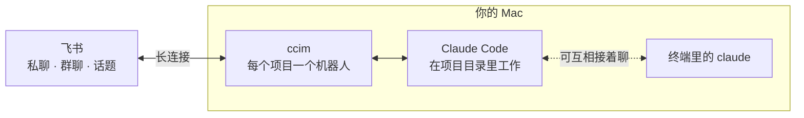

<div align="center">

# ccim

**在飞书里和你电脑上的 Claude Code 对话**

每个项目一个飞书机器人。手机上发一句话，Claude 就在那个项目目录里动手干活。

[](LICENSE)    

简体中文 · [English](README.en.md)

</div>

---

## 能做什么

- 📱 **随时随地用 Claude Code**：在飞书里发消息，就等于在项目目录里用 Claude Code。项目的 CLAUDE.md、skill、斜杠命令都能用，用的是你本机 `claude` 的登录。
- ⚡ **扫码就能用**：第一次运行扫一下码，自动在你的飞书账号下建好机器人，不用去开放平台配置，也不需要公网地址。
- 👀 **看得见进度**：Claude 干活时有一张实时刷新的「工作中」卡片，读了什么、改了什么、在跑什么命令一目了然。
- ✋ **关键操作你拍板**：需要批准的操作会弹出审批卡片，点一下就行。
- 🧵 **话题不打扰主对话**：对某条消息开话题，回复都留在话题里，每个话题是主对话的一个分支。
- 📎 **双向传文件**：发图片、文件给它看；让它把截图、视频、成品发回给你。
- 🔁 **电脑和手机无缝切换**：桌面端或终端里聊到一半要出门，一句话转到飞书接着聊；回到电脑前再接回终端。
- 🛡️ **只听你的**：只响应你本人；群聊里别人能不能用由你决定。密钥存在 macOS 钥匙串里。
- ♻️ **稳定常驻**：开机自启，崩溃、断网后自动恢复；网络抖动时自动重发，不丢回答。

## 工作原理



ccim 运行在你自己的 Mac 上。飞书消息通过长连接送到 ccim，ccim 再交给这个项目目录下的 Claude Code。每个聊天、群、话题各对应一个独立的对话。

## 快速开始

**需要：** macOS · Python 3.11+ 和 [uv](https://docs.astral.sh/uv/) · 已安装并登录的 [Claude Code](https://docs.anthropic.com/en/docs/claude-code) · 飞书或 Lark 账号

**1. 安装**

```bash
uv tool install --compile-bytecode git+https://github.com/lzy2025ai/ccim
```

**2. 在项目目录里运行，扫码配对**

```bash
cd 你的项目目录
ccim
```

终端里会出现二维码，用飞书手机端扫码确认，机器人就建好了。在飞书里搜机器人的名字，私聊它就能开始。

**3. 让它常驻（可选）**

```bash
ccim start --always
```

开机登录后自动启动，崩溃或断网后自动恢复。关掉终端也不影响。

> 升级：`uv tool upgrade ccim`

**4. 装上「转到飞书」skill（可选）**

在 Claude Code 里运行：

```
/plugin marketplace add lzy2025ai/ccim
/plugin install ccim@ccim
```

之后在任何项目的对话里说「我要出门了，转到飞书」，Claude 就会把当前对话转到飞书；回到电脑前说「我回来了」，它会把飞书那边聊过的内容接回来。项目还没接入飞书的话，会在浏览器里弹出二维码，扫完自动配对。其他 Agent 可以直接读 [skills/feishu-handoff/SKILL.md](skills/feishu-handoff/SKILL.md)。

## 在飞书里

| 你做什么 | 会发生什么 |
|---|---|
| 私聊发消息 | 消息上出现一个「OnIt」表情，表示收到了。和你的私聊是一个长期对话，重启后接着聊 |
| 让它干活 | 出现「工作中」卡片，实时显示最近几步；做完变绿，回答单独发一条 |
| 它还在干活时又发了一条 | 和在 Claude Code 里打字一样，直接补充给正在做的任务，它做完当前这一步就会看到。想让它停下改做别的：先发 `/stop`，再发新消息 |
| 遇到需要批准的操作 | 弹出审批卡片：允许 / 本会话都允许 / 拒绝，也可以直接回复 `y` 或 `n`；10 分钟没处理按拒绝算 |
| 发图片或文件 | 保存到项目的 `.ccim/inbox/`，Claude 能直接看 |
| 「把封面发我」 | 它把图片、视频、文件发到聊天里（图片 10 MB、文件 30 MB 以内） |
| 对某条消息「回复话题」 | 回复都留在话题里；话题记得之前聊过的内容，话题里聊的不会带回主对话 |
| 拉进群、@它 | 这个群是一个全新的对话；默认只响应你本人的 @ |

### 斜杠命令

| 命令 | 作用 |
|---|---|
| `/new` | 开始新对话 |
| `/resume [编号]` | 不写编号：列出这个项目最近的对话，终端里开的也在；写编号：接上那个对话 |
| `/stop` | 停下正在做的事，清空排队 |
| `/restart` | 安全重启这个机器人，回来后告诉你结果（只有主人能用） |
| `/status` | 当前状态、模型、思考深度、额度 |
| `/usage` | 5 小时额度、每周额度还剩多少，以及用量明细（中文） |
| `/model 名字` | 换模型：`opus` `sonnet` `haiku` `fable`，或完整模型名 |
| `/effort 等级` | 思考深度：`low` `medium` `high` `xhigh` `max` |
| `/help` | 帮助 |

其他斜杠命令原样交给 Claude，所以项目里的 skill 和 `/compact` 都能用。在话题里发的命令只影响这个话题。

## 命令行

| 命令 | 作用 |
|---|---|
| `ccim` | 在当前目录前台运行，Ctrl+C 退出；没配对过就先扫码 |
| `ccim start [项目]` | 后台运行，关掉终端也不影响 |
| `ccim start --always [项目]` | 常驻：开机自启，意外退出约 30 秒后自动重启 |
| `ccim stop [项目]` | 关停；常驻的同时取消常驻 |
| `ccim restart [项目]` | 重启 |
| `ccim restart --safe [项目]` | 安全重启：新版本起不来就用稳定版顶上，结果发到飞书 |
| `ccim promote` | 开发 ccim 时用：把当前代码装成新的稳定版，逐个升级跑稳定版的项目，起不来的退回上一版 |
| `ccim list` | 所有已配对的项目和在线状态 |
| `ccim show [项目]` | 一个项目的详情：机器人、状态、模型、思考深度、各个对话 |
| `ccim handoff` | 在 Claude Code 的对话里运行：把这个对话转到飞书私聊接着聊 |
| `ccim handback` | 回到电脑前，在同一个对话里运行：把飞书那边聊过的内容接回来 |
| `ccim resume [项目] [编号]` | 在终端里接着飞书里的对话聊；不写编号就接最近的 |
| `ccim logs [项目] [-f]` | 查看后台日志 |
| `ccim config [项目] 键=值` | 项目设置，见下文 |
| `ccim unpair [项目]` | 解除配对 |

`[项目]` 可以写项目目录名、机器人名或路径；不写就是当前目录。

## 设置

```bash
ccim config group=all          # 群里所有人 @ 都响应（默认 owner：只响应你）
ccim config model=sonnet       # 这个项目的默认模型
ccim config effort=high        # 这个项目的默认思考深度
ccim config reaction=THUMBSUP  # 收到消息时加的表情（默认 OnIt）
ccim config runtime=dev        # 跑开发中的代码（默认：装过稳定版就跑稳定版）
ccim config                    # 查看当前设置
```

模型和思考深度不设的话，跟随 Claude Code 自己的设置（项目的 `.claude/settings*.json`，其次是 `~/.claude/settings.json`），和你在终端里用的一致。聊天里用 `/model`、`/effort` 改的只对那个聊天生效。改完设置要 `ccim restart` 才生效。

## 安全

- **只认主人**：只响应配对时扫码的那个人。私聊里别人发消息一律不理，群聊默认也只认你。
- **审批只认你**：审批按钮只有你点才算数。
- **密钥不落盘**：App Secret 存在 macOS 钥匙串（服务名 `ccim`），不写进任何文件。
- **不是完全放开**：Claude Code 用 auto 权限模式，明显危险的操作会被拦下。

> [!WARNING]
> 打开 `group=all` 之前想清楚：群里的人能让 Claude 在你电脑上的这个项目里读写文件、运行命令。auto 模式会拦下明显危险的操作，但不是万无一失。群聊里让 Claude 发文件，只能发项目目录里的。

## 常见问题

<details>
<summary><b>扫码失败怎么办？</b></summary>

可以改为手动填写 App ID 和 App Secret：在飞书开放平台建一个企业自建应用，开启机器人能力，事件与回调都选「长连接」，订阅「接收消息」「机器人进群」事件和「卡片回传交互」回调。

手动配对后，终端会给出一串认领口令，在飞书里私聊机器人发送这串口令，机器人就认你为主人。
</details>

<details>
<summary><b>接很多项目、经常开新对话，会很占资源吗？</b></summary>

不会。每个接入的项目常驻约 110 MB。每个正在进行的对话约 200 MB，再加上你给 Claude Code 配置的 MCP 服务；空闲 30 分钟后自动释放，下条消息再接上。`/new` 会先关掉旧对话再开新的，不会越积越多。
</details>

<details>
<summary><b>在 Claude 桌面端聊到一半要出门，能转到飞书接着聊吗？</b></summary>

能。装上「转到飞书」skill 后（见快速开始第 4 步），直接对 Claude 说「我要出门了，转到飞书」；没装的话，让它运行 `ccim handoff`。机器人会主动给你发一条消息，附上刚才聊到的内容，手机收到推送点开就能接着聊，模型和思考深度也沿用桌面端的。终端里同时会显示一个二维码，扫了直接打开和机器人的聊天。

飞书那边接的是一个独立的分支，要不要带回电脑由你决定：回到原来的对话发消息时，如果飞书那边有新内容，Claude 会先问你一句要不要带过来（装了插件才有这个提醒）。你说要，它就读出你在飞书里聊过什么、改了哪些文件，接着往下聊；你说不要，就照常聊，同一批内容不会再问。也可以直接说「我回来了」或者让它运行 `ccim handback`。项目还没接入飞书的话，会先在浏览器里弹出配对二维码；ccim 没在运行的话会自动在后台启动。
</details>

<details>
<summary><b>飞书里聊的，能在终端里接着聊吗？反过来呢？</b></summary>

都可以。终端里运行 `ccim resume` 接上飞书里最近的对话；飞书里发 `/resume` 列出这个项目最近的对话（包括终端里开的），再发 `/resume 编号` 接上。

如果另一边的对话还开着，会另开一个分支：之前的内容都在，之后两边各聊各的，互不干扰。
</details>

<details>
<summary><b>用的是哪个模型、什么思考深度？</b></summary>

默认和你在终端里用 Claude Code 时一样。发 `/status` 能看到实际在用的值，以及是跟随设置还是单独改过的。
</details>

<details>
<summary><b>出问题了在哪看日志？</b></summary>

前台运行时直接看终端；后台和常驻运行时用 `ccim logs -f`。
</details>

## 已知限制

- 只支持 macOS 和飞书 / Lark。
- 扫码建机器人用的是飞书的设备码注册接口，这个接口不在飞书公开文档里，将来可能变动；失效时可以手动填写 App ID 和 App Secret。
- 机器人的回复和命令行提示目前只有中文。

## 文件位置

| 位置 | 内容 |
|---|---|
| `~/.ccim/registry.json` | 已配对的项目 |
| `~/.ccim/projects/<编号>/` | 每个项目的运行状态和后台日志 `ccim.log` |
| `<项目>/.ccim/inbox/` | 飞书里收到的图片和文件（自带 `.gitignore`，不会被提交） |

## 开发

```bash
git clone https://github.com/lzy2025ai/ccim && cd ccim
uv venv && uv pip install --compile-bytecode -e .
ln -sf "$PWD/.venv/bin/ccim" ~/.local/bin/ccim
```

代码结构、设计取舍和本地测试方法见 [CLAUDE.md](CLAUDE.md)。想接其他 IM（比如企业微信）：在 `ccim/channels/` 里实现 `base.py` 的 `Channel` 接口，在 `cli.py` 的 `CHANNELS` 里登记。欢迎提 Issue 和 PR。

## 致谢

扫码建机器人、长连接收发卡片的做法参考了 [NousResearch/hermes-agent](https://github.com/NousResearch/hermes-agent) 的飞书接入。

## 许可证

[MIT](LICENSE)
